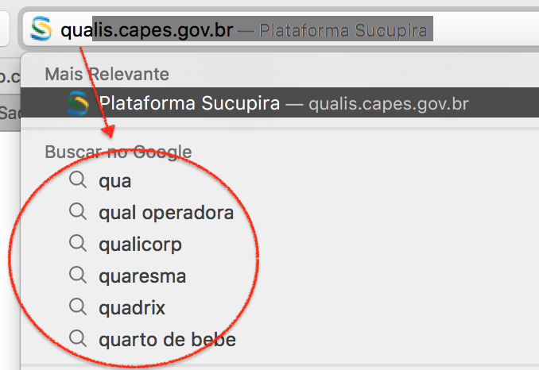

# Autocomplete

A C++ implementation of a text autocomplete program

### Table of Contents

1. [Introduction](#1-introduction)
2. [Interface](#3-interface)
3. [How to Build](#4-how-to-build)
4. [How to Run](#5-how-to-run)

# 1. Introduction

Autocomplete is pervasive in modern applications. As the user types, the program predicts the complete query (typically a word or phrase) that the user intends to type.

Here we have a typical example of autocomplete in action.




Autocomplete is most effective when _there are a limited number of likely queries_. For example, the Internet Movie Database uses it to display the names of movies as the user types; search engines use it to display suggestions as the user enters web search queries; cell phones use it to speed up text input.

In these examples, the application predicts how likely it is that the user is typing each query and presents to the user a list of the top-matching queries, in descending order of **weight**. These weights may be determined by several factors, such as the historical data of box office revenue for movies, frequencies of search queries from other Google users, or the typing history of a cell phone user. For the purposes of this assignment, you will have access to a set of all possible queries and associated weights (and these queries and weights will not change).

The performance of autocomplete functionality is critical in many systems. For example, consider a search engine which runs an autocomplete application on a server farm. According to one study, the application has only about 50ms to return a list of suggestions for it to be useful to the user. Moreover, in principle, it must perform this computation for every keystroke typed into the search bar and for every user!

# 2. Interface

The program, called `autocomplete`, reads command line arguments, as follows:

```shell
% ./autocomplete
Usage: autocomplete <database_file>
  Where <database_file> is the ascii file that contains the query terms and weights.
```

The `<database_file>` is the ascii file that contains `n` lines, each of which containing a query string and the corresponding integer weight.

You may download two database files [here](data).

# 3. How to Build

To create a build of this program, on the base directory of the project run the following commands:

```shell
cmake -S ./ -B build
cmake --build build
```

### Windows and MinGW

If you are running this on a Windows machine and using MinGW as a compiler, you might want to use the following command instead. This will make sure you are using MinGW and prevent any futher issues that might occur.

```shell
cmake -S ./ -B build -G "MinGW Makefiles"
cmake --build build
```

Be aware that CMake uses a cache file, so if you are already using the proper Windows command and still facing issues on the build process, either delete the `CMakeCache.txt` file on the build directory or change your build directory to a new one.

Note: Be sure to have POSIX threads, otherwise this might not run as intended or not even compile at all.

# 4. How To Run

Once you have builded the executable of the program, to run it, you can simply type:

```
autocomplete <database_file>
```

Where <database_file> is the ascii file that contains the query terms and weights.

Author: Lucas do Nascimento Ribeiro
